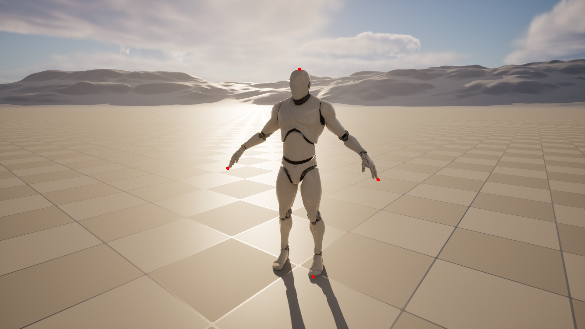
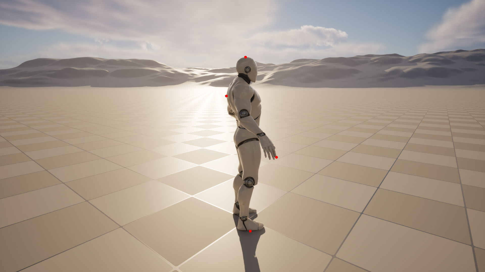
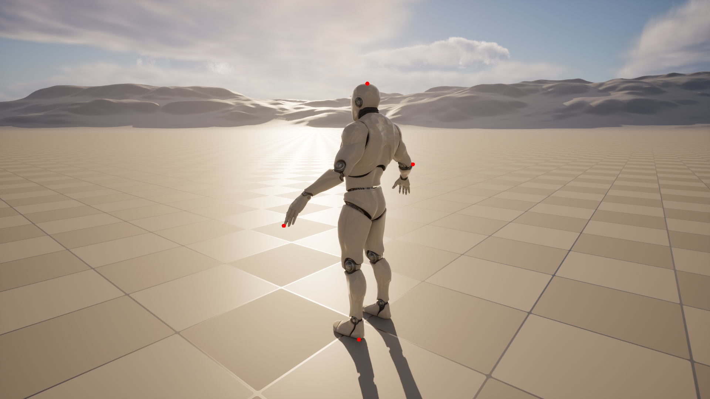

# Extreme Points Recognition for Unreal Engine

- Current version: Unreal Engine 5.3

This application allows you to take screenshots by overlaying 
the extreme points on the selected skeletal mesh.

The project includes a test level that contains a **rotating skeletal mesh** and a **player character**.

To demonstrate how it works, run this level, select the desired camera position (WSAD + mouse rotation) and press F.

The screenshots taken will be saved in **DSSL_ExtremePoints/Screenshots/**

**Note: If there are already any screenshots there, they will be overwritten.**

Some examples:

